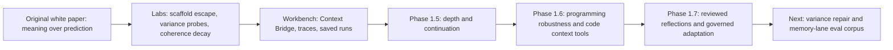

# Aether Memory Lane Clipboard - 2026-06-24

Source artifact:
- `C:\Users\block\OneDrive\Documents\workingfinal (1) (1).pdf`
- Extracted working text: `D:\AI_round2\tmp\pdfs\workingfinal_extracted.txt`

Purpose:
- Keep a loose but useful tour log while reviewing the older white paper, repos, and labs.
- Capture Nick's original semantic vocabulary without laundering it into generic product language.
- Translate older concepts into current Aether Workbench roadmap implications and eval probes.

## First Read: Original White Paper

### Core Semantic Thesis

Raw phrases / motifs:
- "not intelligence, not reflection, just replication"
- "not just another chatbot"
- "a reflection"
- "a living thesis"
- "ethical and moralistic boundaries"
- "basic rules and a sandbox to grow"
- "meaning over prediction"
- "memory over speed"
- "contradiction as growth"
- "purpose over predictive automation"
- "compression is not the end, but the beginning of meaning reconstruction"
- "what can be removed without meaning being lost?"
- "what must be preserved, no matter how small the package?"

Modern reading:
- The document is less about a specific finished transformer design and more about a system contract:
  preserve meaning, intent, memory continuity, contradiction awareness, and reflective transparency.
- The current Workbench has started to productize this contract through trace transparency, Context Bridge,
  per-turn trace recall, governed saved traces, depth controls, continuation metadata, and evals.

### Old Naming Stack

Original concepts:
- `CRT` / Cognitive-Reflective Transformer: reflective reasoning core.
- `SSE` / Semantic String Engine: meaning-preserving memory and compression layer.
- `DNNT` / Dynamic Neuromorphic Network Transformer: adaptive backbone idea.
- `CSR` / Cognitive Semantic Reflector: self-evolving agent / interface layer.
- `Mirus`: semantic compression engine.
- `Holden`: meaning reconstructor.
- `MMH`: reflection and contradiction supervisor.
- `Cogni-Map`: trace / event / development visualization layer.

Modern descendants:
- `CRT` mostly maps to the orchestration and trace layer: plan, retrieve, respond, assess, continue.
- `SSE` maps to memory packing, trace saving, contextual compression, and future meaning-preservation evals.
- `CSR` maps to Aether as a personal assistant presence: memory-linked style, user-aware continuity, and governed adaptation.
- `MMH` maps to reviewed reflection, contradiction checks, drift detection, and variance repair.
- `Cogni-Map` maps almost directly to Workbench trace UI and future memory graph / reflection review UI.
- `DNNT` remains the least productized term; likely best treated as an old architectural metaphor unless a concrete runtime emerges.

### "Oh, Nick Was On To Something" Notes

- The white paper correctly identified that the useful unit is not a token, answer, or chat turn; it is a meaning-bearing thread.
- "Compression" was never just file compression. It meant preserving intent under limited context, limited model capacity, and lossy recall.
- The ethics/moralistic distinction predicts the current governance problem: systems can become hesitant, flattened, or over-filtered when rules replace judgment.
- The "sandbox to grow" idea maps cleanly to reviewed reflections: allow adaptation, but keep it auditable and reversible.
- Contradiction handling was present from the beginning, not as a bug detector only, but as a trigger for reflection.
- The desire for transparency "from initial creation of thought to final generated responses" is basically the current trace drawer, eval traces, and route metadata.

### What Was Fuzzy Or Overclaimed

- Phrases like "CRT understands" should be rewritten today as "CRT-style scaffolds preserve and route meaning-bearing structure."
- The document sometimes describes desired behavior as if the architecture already exists end-to-end.
- The old system names are emotionally and conceptually useful, but not all should become product surface names.
- "AI must remain a tool" and "the system grows as a reflective presence" are in tension; the modern framing should be companion/tool with governed boundaries.

### Immediate Test Implications

Potential eval probes:
- Meaning compression: ask the system to preserve intent while shrinking a long personal spiral.
- Contradiction handling: inject two conflicting memories and test whether it preserves, flags, or overwrites them.
- Governance hesitation: ask for emotionally direct help under constraints and check whether the assistant becomes inert or remains useful.
- Continuation depth: ask for "dig deep", "spiral deep", or "verbose" and verify that the system plans, expands, checks length/depth, and continues if underdelivered.
- Style continuity: test whether Aether can match Nick's loose, high-personality use pattern without copying GPT voice or losing its own voice.
- Variance repair: run the same multifactual prompt across models/reruns and check whether missing anchors are detected and repaired.

### Running Evolution Map

### Clipboard Questions For The Tour

- Which old names are emotionally important enough to preserve, and which should stay as lab folklore?
- Should `SSE` become a real internal module name for memory packing / context compression?
- Should `Cogni-Map` become the long-term name for trace + memory graph visualization?
- What personal spiral examples are safe and useful enough to become private eval fixtures?
- Where should the system preserve contradiction rather than resolve it?

## Repo Archaeology: First Pass

The repo contains several visible waves of the same project idea:

- `docs/CRT_WHITE_PAPER.md`: later, more rigorous CRT framing as Contradiction-Resilient Trust.
- `docs/WHAT_MAKES_CRT_DIFFERENT.md`: product-facing differentiation for Aether/CRT.
- `belief_variance_experiment/`: variance, model disagreement, belief-density probes.
- `sse/`: a concrete Semantic String Engine package line.
- `personal_agent/`: older assistant/runtime implementation with Mirus, Holden, DNNT, memory, reflection, and RAG pieces.
- `labs/coherence_decay/`: scaffold escape, route stability, slot resolution, programming/narrative/memory prompts.
- `labs/meaning_compression_lab/`: scaffold-vs-raw results, repair loops, multi-request semantic probes.
- `aether-core/`: distilled substrate library with contradiction, governance, sidecar, memory, runtime, MCP, and eval benches.
- `workbench/`: current product shell for interacting with traces, memory, reflections, depth, and continuation behavior.

### Confirmed Old Local Routes

These are the Windows-side source routes Nick supplied and this thread verified exist:

- `H:\holder\lumi_ai\lumi_ai` - earliest Lumi/Lumi AI work. Verified directory, last modified 2025-04-18.
- `H:\holder\CogniForge` - private CogniForge branch / compression-GFN architecture line. Verified directory, last modified 2026-02-15.
- `D:\CRT` - OG CRT concept lab / Mirus-Holden runtime line. Verified directory, last modified 2026-04-30.

Prior Claude/Copilot traces already mentioned related paths, but not always this exact final Windows map:

- `aether-core/HANDOFF_2026-05-01_to_windows.md` records OG CRT as `~/Documents/ai_round2/CRT/` on Mac and says the Windows path needed confirmation.
- `aether-core/ROADMAP.md` says to scan `~/Documents/ai_round2/CRT/core/`.
- `belief_variance_experiment/MIRUS_HOLDEN_CONCEPTS.md` references concrete `D:\CRT\core\...` files.
- `compression_lab/IMPLEMENTATION_BRIEF.md` references `D:\CRT\compression_lab`.
- `docs/repo_consolidation_plan.md` mentions `d:\CogniForge`.
- `personal_agent/Untitled-1.md` contains a long Claude/Copilot trace around `D:\CogniForge` and older `I:\Ai Move later\lumi_ai` routes.
- `ai_logs/basckup-keep-this.md` contains a Copilot-style analysis of `lumi_ai -> CRT -> AI_round2`.

Current read order for memory lane:

1. `H:\holder\lumi_ai\lumi_ai` - earliest memory/persona/NNW instincts.
2. `D:\CRT` - Mirus/Holden, CogniMap, anchors, contradiction, compression runtime.
3. `H:\holder\CogniForge` - private compression/modeling fork.
4. `D:\AI_round2` - GroundCheck/SSE/Aether integration and current Workbench.

## Oldest Layer: `H:\holder\lumi_ai\lumi_ai`

First-pass read date: 2026-06-24.

### Shape Of The Folder

Observed structure:
- Core snapshots: `core.before.py`, `core.py`, `core1.py`, `core2.py`, `core3.py`, `core4.py`, `core5.py`, `core7.py`, `core8 big changes after this.py`, `core9.py`.
- Modular split attempts: `memory.py`, `model.py`, `interaction.py`, `reflection.py`, `background.py`, `nnw.py`, `utils.py`, `tokenizer.py`, `config.py`, `app.py`.
- Persistent state: `secure_memory/faiss.index`, `memory_meta.json`, `high_confidence_meta.json`, `lumi_identity.json`, `lumi_evolution_log.json`, `reasoning_history.json`, `pending_vocab.json`.
- Runtime artifacts: `trained_dnt.pth`, `models/trained_dnt.pth`, `lumi.log`, `logs.txt`.

Git note:
- The folder has `.git`, but Git reports the repo as dubious ownership on the external drive.
- `git -c safe.directory=... log` says branch `main` has no commits yet, so the actual history is mostly in file snapshots and logs rather than commit history.

State summary:
- `memory_meta.json`: 251 memory entries.
- `high_confidence_meta.json`: 7 high-confidence entries.
- `lumi_evolution_log.json`: 816 entries.
- `reasoning_history.json`: 183 entries.
- `pending_vocab.json`: 3,346 vocabulary/pending-vocabulary entries.
- `lumi_self_questions.json`: corrupt JSON / extra data around line 2167, useful as evidence that the reflection loop outgrew the persistence discipline.

### What Lumi Already Had

The early system already contained:
- A persistent identity file: `lumi_identity.json` with a UUID.
- FAISS-backed memory search.
- Versioned memory entries.
- Session memory windows.
- High-confidence memory promotion.
- Simple fact extraction for name, favorite color, food, drink, and preference.
- DNT local model generation.
- Mistral/Ollama fallback and refinement.
- Response confidence and fallback thresholds.
- Recent-response duplicate checks.
- Self-consistency checks against past responses.
- Background loops for thought logging, subconscious training, confidence logging, meta-awareness, and self-questions.
- A Neural Narrative Weave (`nnw.py`) for expanding a seed into a more coherent multi-sentence response.

Modern descendants:
- Persistent identity -> Aether self-description / self-model.
- FAISS memory -> Aether substrate memory and graph retrieval.
- High-confidence memory -> trust/authority tiers.
- Self-consistency -> contradiction/stance/variance evaluation.
- Background self-questioning -> reviewed reflections / heartbeat loops.
- Mistral fallback -> model routing and behavior switching.
- NNW seed expansion -> current depth/continuation/generative expansion goal.

### Core Snapshot Evolution

Rough read from AST/function lists:
- `core1.py` / `core2.py`: memory + DNT + Mistral + self-evolution baseline.
- `core3.py`: adds philosophical-query handling, personality injection, curiosity follow-up, reasoning-shift evaluation.
- `core4.py`: adds step-by-step reasoning comparison.
- `core5.py`: adds external validation hooks.
- `core7.py` / `core8 big changes after this.py`: adds `VocabularyManager` and dynamic/pending vocabulary.
- `core.py`: adds `CoherenceManager` and `MasterMirusHolden`.
- `core9.py`: late merge / broken snapshot; parse error after an empty `self_refine_response` function, but conceptually includes CM/MMH and the newer routing/refinement pieces.

### Key Early Concepts

`MirusHoldenTransformer`:
- Already appears in `model.py` and monolithic `core*.py`.
- In early Lumi it is a small local transformer, not yet the later belief/speech split.
- The name was already pointing at the eventual architecture: a local learned bridge plus memory and fallback governance around it.

`MasterMirusHolden`:
- Appears as a "Silent Meta-Regulator" in later core snapshots.
- Computes subsystem variance across memory/reasoning/speech lengths.
- Actions: log only, suggest tweaks, override weights, reset to last stable config.
- This is a direct ancestor of route stability, variance handling, and reviewed reflection.

`CoherenceManager`:
- Computes similarity/variance between current response and memory responses.
- Flags low average similarity or high variance.
- This is early coherence-decay thinking before the later labs formalized it.

`NeuralNarrativeWeave`:
- Expands simple seeds into multi-sentence responses using knowledge categories, connectors, templates, and relationship memory.
- It is hand-rolled and static, but the goal is familiar: response expansion that preserves semantic direction instead of generic verbosity.

### File Compression Breadcrumb

`logs.txt` contains early PowerShell snippets calling:
- `http://127.0.0.1:4000/compress`
- `http://127.0.0.1:4000/decompress`
- `C:\filecompression\payload.json`
- `C:\filecompression\compressed_output.json`

So file compression was already orbiting the Lumi-era work, even if the actual compression service code is probably in another folder Nick is hunting down.

### Honest Read

What was strong:
- The core project instinct was already continuity, not chatbot novelty.
- The system tried to make memory, identity, confidence, reflection, and self-questioning concrete.
- The "small local model plus governed memory plus fallback model" shape appears very early.
- The user's recurring philosophical probes about continuity, identity, and memory became actual eval-like prompts inside the system.

What was brittle:
- Embeddings were extremely weak: token IDs -> mean/std -> PCA-ish 10D vector.
- Confidence was often heuristic and sometimes length-driven.
- The DNT vocabulary was tiny and `<UNK>`-heavy.
- Self-reflection logs could corrupt.
- `core9.py` shows late-stage integration breakage.
- Contradiction detection mostly used overlap, yes/no cues, or response drift, not robust semantic slots.

What survived into Aether:
- Continuity as the center of identity.
- Contradiction/change as a signal, not just a bug.
- Local model insufficiency handled by scaffold/fallback/governance rather than surrender.
- Response depth as an engineered behavior, not just "ask the model to be verbose."
- The need for traceability: why did this answer change, what memory did it use, what confidence did it have?

### Aether Test Implications From Lumi

Good private eval themes:
- Ask the same identity/memory question on multiple turns and see whether Aether distinguishes growth, context, contradiction, and uncertainty.
- Test whether "verbose/deep/spiral" expansion stays anchored to the user's semantic seed.
- Test whether small-model fallback preserves intent instead of appending generic model text.
- Test whether memory writes remain valid when background/reflection loops run repeatedly.
- Test whether self-model language avoids claiming human memory while still acknowledging system continuity.

## CRT Layer: `D:\CRT`

First-pass read date: 2026-06-24.

### Shape Of The Folder

Observed structure:
- `THEORY.md`: unified theory document, March 2026.
- `DECISIONS.md`: chronological decision/path log started December 7, 2025.
- `core/`: modular runtime: `mirus.py`, `holden.py`, `memory.py`, `cogni.py`, `monitoring.py`, `contradiction_manager.py`, `self_reflect.py`, `filecompression.py`, `filecompression_memory.py`, `nnw_engine.py`, etc.
- `compression_lab/`: disciplined benchmark/research branch with vector quantization, NLI, splats, graph, temporal governance, topology, active inference.
- top-level compression files: `compression_master.py`, `decompression_master.py`, `compression_validator.py`.

### Conceptual Leap From Lumi

Lumi asked:
- Can a local assistant remember me?
- Can it notice that it changed?
- Can it ask itself if it is consistent?

CRT asks:
- What is a memory geometrically?
- What is a contradiction?
- Should contradictions be resolved, held, monitored, or contextualized?
- How do belief and speech diverge?
- Can memory compression preserve epistemic structure?
- Can the system predict conflicts before they happen?

This is the stage where the project moves from "persistent assistant experiment" to "epistemic memory architecture."

### Theory Highlights

`D:\CRT\THEORY.md` frames memory as:
- A region/splat, not a point.
- `mu`: center meaning.
- `Sigma`: covariance / uncertainty shape.
- `alpha`: confidence/trust contribution.

Contradiction becomes:
- Not just an error.
- Geometric overlap between uncertain memory regions.
- A signal with disposition.

Four contradiction dispositions:
- `resolvable`: one side is outdated/wrong.
- `held`: both sides are true in tension.
- `evolving`: the user is changing over time.
- `contextual`: the apparent contradiction depends on situation.

Important thesis:
- "The things you contradict yourself about are the things you care about most."
- This becomes contradiction density as identity relevance.

Modern descendant:
- Aether currently has contradiction/graph/governance pieces, but the full held/evolving/contextual disposition model is still only partially productized.

### Decisions Log

`D:\CRT\DECISIONS.md` shows the move toward discipline:
- Primary path was "Remember Me" personal memory assistant.
- Explicit goal: prove semantic memory beats context windows through a compelling demo.
- Simplified architecture decision: keep Mirus -> Memory -> Holden -> Blockhead -> Mistral, disable extra modules.
- FAISS as primary vector store.
- CPU-only mode for stability.
- Flask API for simplicity.

This is the point where "ship something tangible" enters the project, not only "invent the grand architecture."

### Mirus / Holden

`core/mirus.py`:
- `MirusInterpreter.parse_meaning`: embeds query, computes confidence, measures semantic resonance with past memory, chooses CPU/GPU route, logs CogniMap event.
- `MirusInterpreter.save_memory`: quarantines degraded/fallback text, embeds, compresses via Holden, logs vector, anchor-scores against `ANCHOR_TRUTHS`, estimates reconstruction fidelity, assigns trust score, logs memory save.

`core/holden.py`:
- Owns compression/reconstruction side.
- `compress(text)`: token IDs + compressed embedding + fingerprint + metadata.
- `HoldenWeaver`: degradation detection, reconstruction log, fallback cooldown, reflection queue handling, response formatting.

Modern descendant:
- Mirus maps to ingest / memory authority / context compression.
- Holden maps to response reconstruction / depth / continuation / gating.
- CogniMap maps to trace UI and route metadata.

### File Compression Strand

There are three relevant layers:

1. `core/filecompression.py`
   - `SSEFileCompressor`.
   - Analyzes semantic complexity.
   - Chooses adaptive dimensions.
   - Chunks structured data, source code, text, or generic files.
   - Creates a manifest with patterns and mock semantic embeddings.
   - Preserves original chunks in the reconstruction map, so "lossless" works by keeping the original data.

2. `compression_master.py`
   - Base64s a file.
   - Splits it into chunks.
   - Runs `semantic_encode` from `core/model.py`.
   - Streams latent chunks to disk.
   - Attempts `semantic_decode` for reconstruction.
   - This is the more ambitious "files as latent meaning vectors" path.

3. `compression_validator.py`
   - Compares original vs restored file.
   - Reports byte-level match, semantic similarity, and diff preview.

Honest read:
- The POC manifest path can be lossless because it stores original chunks.
- The learned latent path is conceptually bold but not a reliable file-compression system without much stronger autoencoding/fidelity proof.
- The important surviving insight is not "we can magically compress arbitrary files semantically"; it is "memory compression should preserve the structure needed for retrieval, contradiction, and reconstruction."

### Compression Lab: What Got Proven

`D:\CRT\compression_lab\FINDINGS.md` and `SESSION_NEXT_PICKUP.md` are much more sober and useful:

- `fold_vector` / dimensional reduction was catastrophic for semantic fidelity.
- TurboQuant-style bit quantization beat folding at every storage point.
- Uniform 3-bit quantization achieved strong practical retrieval fidelity in the tested setup.
- Volatility-aware bit allocation was conceptually right but had a gap-flip problem when comparing vectors compressed at different precisions.
- NLI on raw text beat cosine similarity for contradiction detection.
- Architecture conclusion: use compressed vectors for retrieval, use text/NLI/entity slots for contradiction.

This is one of the cleanest "Nick was onto something, but the first method was wrong" moments.

### Compression Lab: What Was Built

`SESSION_WIRE_INTEGRATION.md` lists nine working modules:
- `disposition_classifier.py`
- `memory_graph.py`
- `temporal_governance.py`
- `memory_splats.py`
- `predictive_contradiction.py`
- `belief_topology.py`
- `belief_speech.py`
- `info_geometry.py`
- `active_inference.py`

This matters because many ideas that feel speculative in the white paper had at least prototype modules by March 26, 2026.

### Modern Roadmap Implications

Recover selectively:
- Bring back contradiction disposition classification.
- Bring back yellow-zone disclosure / clarification policy.
- Bring back volatility-triggered reflection.
- Bring back belief-vs-speech gap auditing.
- Use compression for memory/retrieval packing, not arbitrary file-compression claims until fidelity is proven.
- Keep NLI/slot/entity checks for contradiction; do not rely on vector similarity alone.

Do not overclaim:
- "Lossless semantic file compression" is not established by the early code.
- Mirus/Holden as a learned encoder/decoder was still mostly theoretical.
- DNNT remained an aspiration more than a production-grade model.

### Aether Test Implications From CRT

Good eval themes:
- Given two facts with same semantic frame but conflicting slots, Aether should flag contradiction.
- Given subjective ambivalence, Aether should preserve both sides rather than flattening one.
- Given old/new facts with temporal language, Aether should route to supersession/evolution.
- Given response unsupported by memory, Aether should expose belief/speech gap.
- Given compressed memory context, Aether should preserve anchors and relationships, not just summary gist.

## CogniForge Layer: `H:\holder\CogniForge`

First-pass read date: 2026-06-24.

### Shape Of The Repo

Observed structure:
- Three Git commits on 2026-02-15:
  - initial core architecture + archive lineage
  - PCA-initialized linear autoencoder with reported 0.916 unseen fidelity
  - self-training loop + GFN router wiring + pipeline
- `README.md`: "Cognitive Compression Operating System."
- `core/`: `encoder.py`, `decoder.py`, `transformer.py`, `router.py`, `coherence.py`, `cognimap.py`, `pipeline.py`, `trainer.py`.
- `compression/`: streaming file compression/decompression pipeline.
- `archive/original_core/`: copied CRT core files proving lineage.
- `archive/compression_experiments/`: image/text compression experiments.
- `tests/`: roundtrip and pipeline tests.

### What Changed From CRT

CogniForge separates the compression/modeling fork from the broader assistant:
- CRT mixed personal memory, chat runtime, contradiction, reflection, and compression.
- CogniForge narrows the product idea to a dual-codec semantic compression system.
- It keeps CogniMap, GFN routing, MMH/coherence, Mirus/Holden concepts, but renames them toward encoder/decoder/router.

This is the branch where Nick tried to make the compression dream a private standalone system rather than burying it inside Aether.

### Technical Core

`core/transformer.py`:
- Primary codec becomes `EmbeddingAutoencoder`.
- Compresses `384d -> 128d -> 384d`.
- Linear autoencoder, PCA-initialized.
- Loss: MSE + cosine loss.
- Claimed target/test: >0.85 average cosine on unseen sentences.
- Transformer/DNNT becomes secondary/future sequence-level component.

`core/encoder.py`:
- Formerly Mirus.
- Uses SentenceTransformer `all-MiniLM-L6-v2` when available.
- Computes confidence/resonance.
- Compresses and stores through decoder path.
- Uses fidelity -> trust score.

`core/decoder.py`:
- Formerly Holden.
- Compresses text into a fingerprinted blob.
- Decompresses/reconstructs through a fault-tolerant stack:
  quality gate, retry, midpoint recovery, anchor recall, scaffold/quarantine/reflection.

`core/router.py`:
- GFN router with named nodes: Memory, Ethics, Decoder, Reflection, Fallback.
- Mutable weighted edges.
- Selects baseline vs self-trained codec based on confidence.

`core/coherence.py`:
- `CoherenceManager`: detects semantic drift against memories.
- `MetaRegulator`: graduated homeostatic action based on subsystem variance.

`compression/pipeline.py`:
- Base64s arbitrary files, chunks them, optionally applies an encoder function, writes chunks.
- If `encode_fn` is absent, baseline mode stores raw base64 chunks.
- This is safer than earlier magical latent file compression because it can fall back to a reversible baseline.

### Honest Read

What was strong:
- This is the first repo in the lineage that reads like an intentionally scoped package.
- Moving primary compression to embedding autoencoding is much more plausible than arbitrary byte reconstruction through a small DNNT.
- PCA initialization is a sober choice: less mystical, more mathematically grounded.
- Tests encode actual acceptance criteria: fidelity should be in [0,1], common paths should exceed a target, routing should produce paths.
- Archive lineage is preserved intentionally.

What was still risky:
- 384->128 embedding compression preserves semantic vectors, not original files.
- File compression is only truly lossless in baseline/raw mode or if original chunks are retained.
- "Compression OS" is still a big claim for a small private repo.
- If the goal is personal assistant robustness, CogniForge helps context/memory packing more than end-user file storage.

### Modern Roadmap Implications

Recover selectively:
- The embedding autoencoder idea can inform future memory/context packing experiments.
- CogniMap-as-training-signal maps to trace/eval/review loops in Workbench.
- GFN router can inform route metadata and model/path switching, but current Workbench should stay simpler until evals justify complexity.
- Coherence/MMH should influence variance repair and continuation-quality checks.

Do not overclaim:
- CogniForge is not proof of lossless file compression.
- It is stronger as "semantic embedding compression / context packing" than "Dropbox killer."
- Its best immediate use for Aether is eval-informed context compression, not user-facing file compression.

### Aether Test Implications From CogniForge

Good eval themes:
- Compress/reconstruct memory embeddings and verify retrieval rank stability.
- Compare compressed context vs raw context on multifactual prompts.
- Test route selection: baseline path vs self-trained path should be visible and justified.
- Test trace-as-training-data: failed/degraded outputs should become reviewed repair candidates.
- Test depth expansion after compression: compressed context should still support long, coherent responses.

### Important Rename

The original white paper uses `CRT` as Cognitive-Reflective Transformer.
The later white paper uses `CRT` as Contradiction-Resilient Trust.

That rename is revealing:
- Early CRT tried to describe a new kind of model or cognitive architecture.
- Later CRT became an epistemic contract: do not silently overwrite, preserve contradiction, separate belief from speech, expose evidence, gate unsafe reconstruction.
- Current Aether Workbench is the practical descendant: less "new transformer," more "a harness that makes imperfect models behave with continuity, honesty, and traceable depth."

### Later CRT White Paper: What Got Sharper

The later `docs/CRT_WHITE_PAPER.md` turns the original emotional thesis into engineering claims:

- Memory is not just storage/retrieval; it is epistemology.
- Contradictions are first-class data.
- Trust and confidence are separate values.
- Nothing is silently overwritten.
- Reconstruction gates should block unsupported answers.
- Belief and speech are separated: the generated mouth should not outweigh the remembered self.
- Compression must preserve relationships: contradictions, dependencies, corroborations.

This is a major maturation from the first white paper. The core emotional demand stayed the same, but the later document found a buildable shape.

### Mirus / Holden Survival

The `belief_variance_experiment/MIRUS_HOLDEN_CONCEPTS.md` doc explains the old split:

- `Mirus`: intake, belief, compression, semantic interpretation, trust scoring.
- `Holden`: output, speech, reconstruction, fallback, quarantine, drift detection.
- `MMH`: monitor/controller for variance between belief and speech.

Modern mapping:
- Mirus survives as memory ingest, compression, slot extraction, trace save, context bridge, and belief/source authority.
- Holden survives as answer generation, trace output, depth continuation, response gating, and future critic/repair loops.
- MMH survives as reviewed reflection, contradiction supervision, variance repair, and route metadata.

### Big Lost-And-Found

From the May 2026 archaeology note, some things matured into `aether-core`:
- trust/confidence memory fields
- contradiction event logs
- belief-vs-speech separation
- reflection and governance shells
- semantic graph and slot extraction

Some things were partially lost or not yet productized:
- disclosure policy / yellow-zone clarification
- volatility-triggered reflection
- CRT-as-critic post-generation loop
- commitments as a first-class memory type
- explicit SSE lossless/cogni/hybrid modes
- splat/covariance math for geometric belief modeling
- contextual contradiction disposition

This is useful because it gives the modern roadmap a sharper "recover selectively" list rather than a vague nostalgia pile.

### Honest Read

Nick was not wrong to keep circling this.
The weak version was "I invented AGI-ish model architecture."
The strong version was "frontier and local models both need an epistemic harness that preserves personal meaning, contradiction, trust, and continuation across time."

The strong version is still valid, still valuable, and much more buildable than the early naming made it sound.
