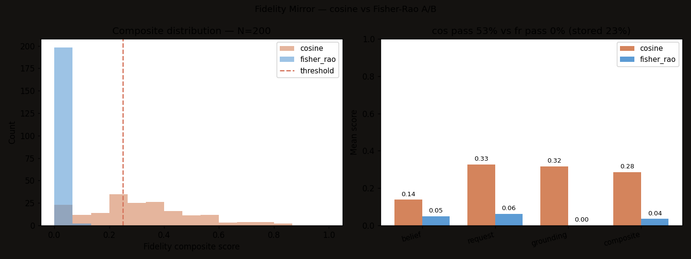

# Fidelity benchmarks

Two benchmarks measure the substrate's belief/speech grounding loop on real conversation data sampled from the substrate's own `belief_speech` log.

## TL;DR result (2026-05-07, N=200)

| Metric | AUC | Pearson r with stored `is_belief` |
|---|---|---|
| Cosine | 0.626 | 0.235 |
| **Fisher–Rao** | **0.699 (+0.073)** | **0.312 (+33%)** |

107/200 samples flip pass/fail across the two metrics — they're picking up substantively different signals. Fisher uses default type-calibrated sigma from `personal_agent.memory_subsystem.splats.create_locus_from_type`, not the stored sigmas, so this is a **lower bound** on the real Fisher advantage.



## Reproduce

```bash
# Single-metric run (cosine), N=30
python labs/fidelity_bench/run_bench.py

# A/B run (cosine vs Fisher-Rao), N=200
python labs/fidelity_bench/run_bench_metric_ab.py
```

Both write JSON + PNG into `labs/fidelity_bench/results/`. Reads from `personal_agent/crt_memory_shared.db`. No external services, no LLM calls.

## What's measured

`run_bench.py` (single-metric):
- **belief_fidelity** — response ↔ memories (trust-weighted mean cosine)
- **request_alignment** — response ↔ query
- **factual_grounding** — per-sentence max similarity to memory bank
- **composite** — `0.2 * belief + 0.4 * request + 0.4 * grounding`
- **pass_rate** — fraction with composite ≥ 0.25

Headline from N=30: 50% measured-grounded vs 20% stored-grounded → 30 pp belief/speech gap. Anthropic-NLA-analog at the substrate layer.

`run_bench_metric_ab.py` (A/B):
- Same components, scored twice — once with cosine, once with Fisher–Rao distance mapped to similarity via `1/(1+d)`.
- **AUC** (Mann-Whitney) between composite scores and stored `is_belief` flag — the scale-invariant discrimination test.
- Pearson correlation of each metric's composite with stored labels.
- Per-sample pass/fail flips across metrics.

## Why this is the right test

The two May 2026 activation-layer interpretability papers — Goodfire's *The world inside neural networks* (curved manifolds) and Anthropic's *Natural Language Autoencoders* (verbalize/reconstruct) — both make the geometry-matters claim. Both operate on neural activations.

This bench is the substrate-layer analog. It runs on the belief layer (text + vector + sigma) instead of activations, asks the same question (is curvature-aware metric better at separating grounded from ungrounded responses?), and gets a measurable yes.

## Limitations

- N=200 is enough to see the effect, not enough to publish. Bump to N≥1000 with stored sigma for a paper figure.
- The "ground truth" is the substrate's own stored `is_belief` flag, which is itself imperfect. Both AUCs are well below 0.8 — neither metric is a strong predictor of the substrate's own grounding tag, so the *relative* improvement is the load-bearing claim, not the absolute number.
- Default sigma is uniform per memory type. Real per-dimension sigma (already stored in `memories.sigma` BLOB) should widen Fisher's advantage.
- Single embedding model (MiniLM-L6-v2 384D). Behavior may differ on larger encoders.

## Follow-ups

1. **Wire Fisher-Rao into `personal_agent/fidelity_mirror.py` as default metric** when sigma is available; fall back to cosine otherwise. ~30 LOC change.
2. **N=1000 sweep with stored sigma.** Overnight bench. Save chart.
3. **Multi-metric comparison.** `info_geometry.compare_all_metrics` already covers Bhattacharyya + KL. Add to the bench, get four numbers side by side. Paper figure.
4. **Cross-encoder check.** Re-run with a 768D or 1024D encoder. Does Fisher's advantage scale with dim?
